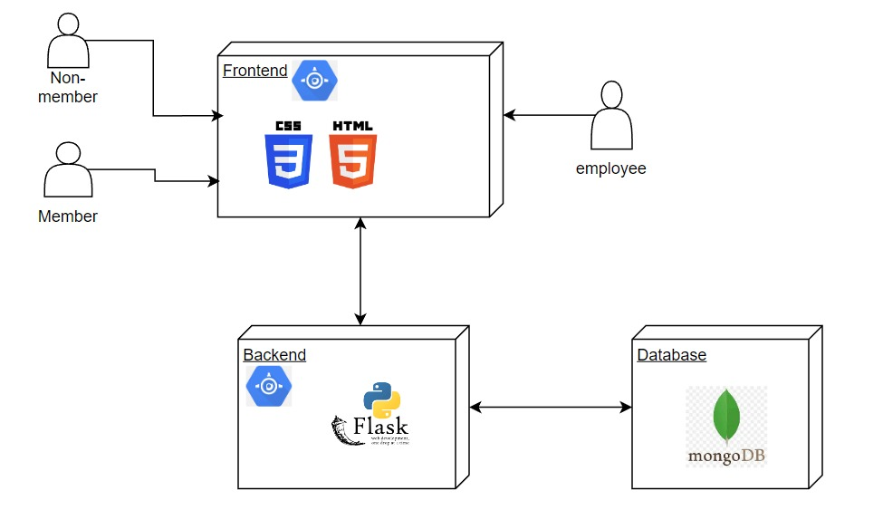
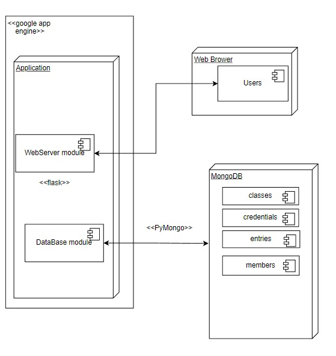
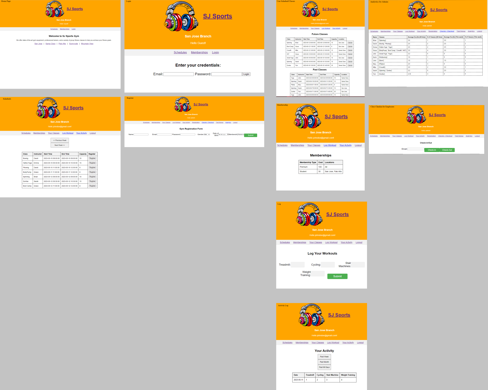
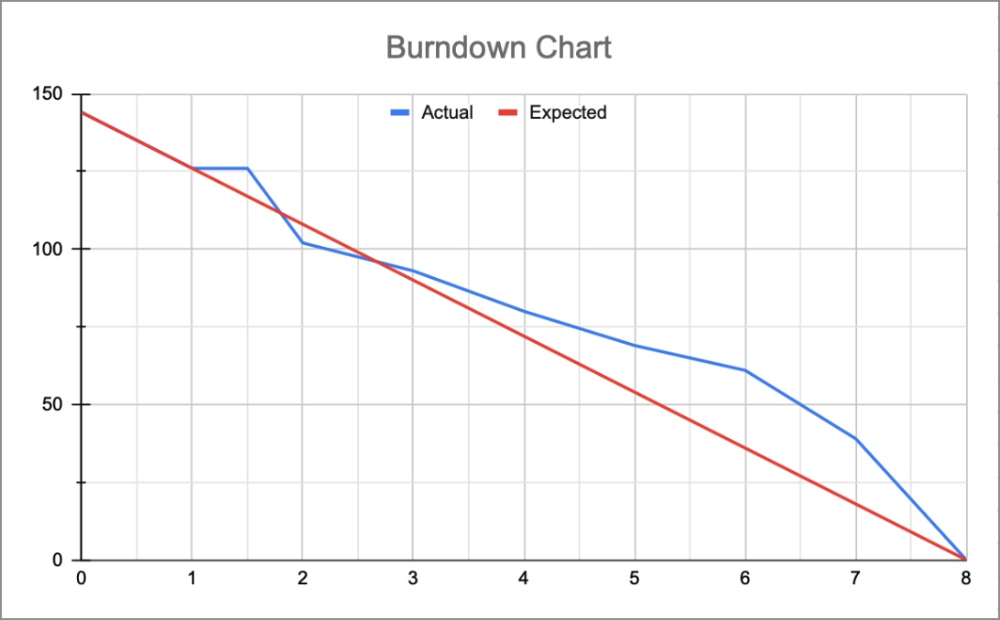

# Health Club Management System - Team NSDK
## Team Members
* Noam Smilovich   - 016065699
* David Wang       - 012087348
* Kaijian Wu       - 010221770
## Contribution
* Noam Smilovich - Frontend and Backend implementation  
* David Wang - Database implementation
* Kaijian Wu - Backend implementation 
## XP Values
* Feedback: Team members provide helpful feekback during each meeting for code quality improvement
* Courage: Team members are encouraged to make design decision change even though some progress has been made fro the previous design decision 
## TECH STACK USED
- Frontend: HTML, CSS
- Backend: Python Flask
- Database: MongoDB 
- Cloud: Google App Engine
## Architecture Diagram

## Deployment Diagram

## UI Wireframe Diagram

## Design Decisions
### Frontend
* HTML, CSS were chosen as the frontend languages.
* The goal was to create a simple user experience and these languages are commonly used for frontend development, making it easier to find resources and support.
### Backend
* Flask, a Python web framework, was chosen as the backend.
* The decision was based on the team's experience and familiarity with Python, as well as Flask's simplicity and flexibility.
### Database
* MongoDB was chosen as the database for the project.
* The decision was based on MongoDB's flexibility in data storage and retrieval compared to traditional relational databases.
### Deployment
Google App Engine was used for cloud deployment, allowing for easy scaling and management of the backend.
## Feature Set
### Guests:
* Able to see weekly studio class schedule according to location
### Members:
* Able to sign up to future studio classes
* Able to view classes taken in the past as well as future signed up classes
* Able to unenroll from a previously signed up class
* Able to log workouts
* Able to view logged workouts (Past week/month/90 days)
### Employees:
* Able to register new members
* Able to sign up guests for a trial
* Able to view analytics for instructors (Average enrollment of past week versus all time)
## Project Journal
* [Project Journal - Noam Smilovich](Project%20Journals/Project%20Journal%20-%20Noam%20Smilovich.md)
* [Project Journal - David Wang](Project%20Journals/Project%20Journal%20-%20David%20Wang.md)
* [Project Journal - Kaijian Wu](Project%20Journals/Project%20Journal%20-%20Kaijian%20We.md)
## Burndown Chart

## Sprint Task Sheet
* [Sprint Task Sheet](Sprint%20Task%20Sheet/Sprint%20Task%20Sheet.xlsx)
